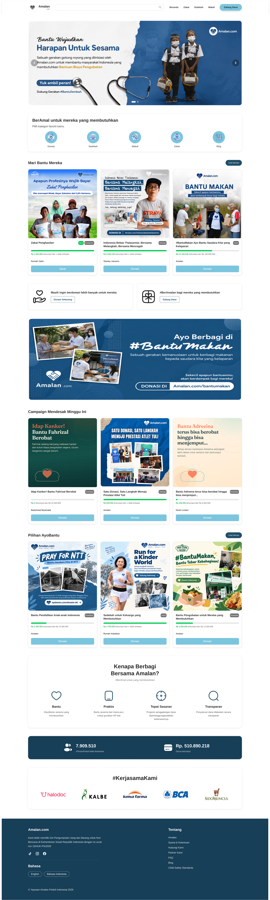
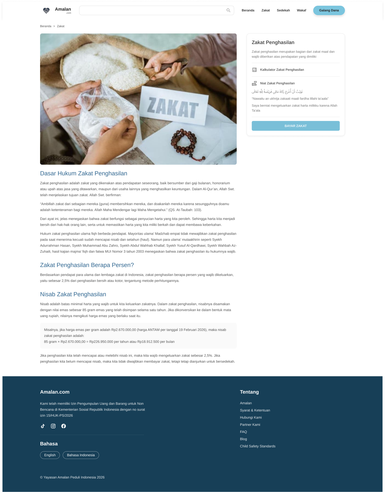
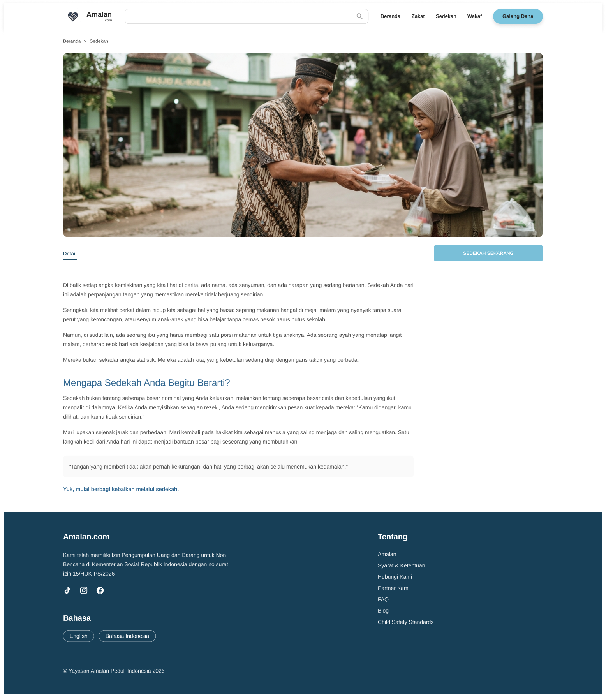
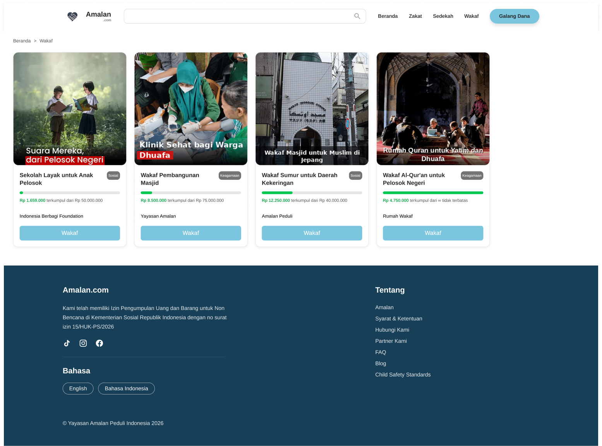
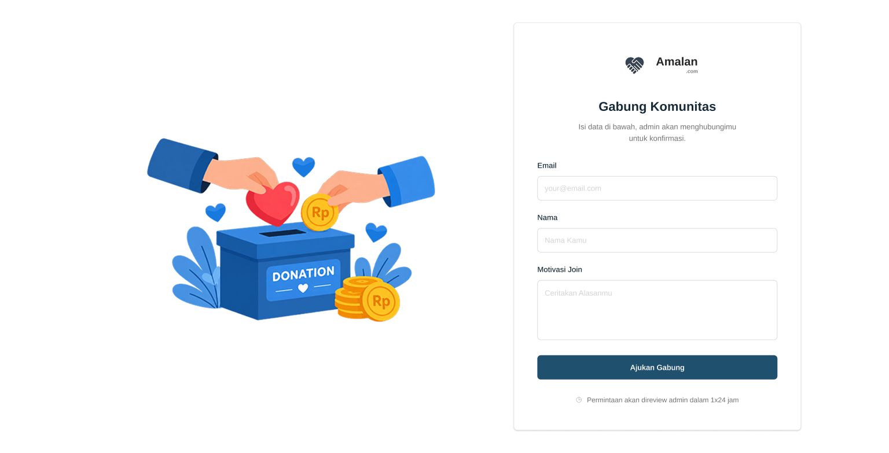

# Amalan.com — Project Development

> A community platform designed to encourage people to share kindness and create meaningful impact through donation, charity, waqf, and zakat.

---

## Project Overview

**Amalan.com** adalah platform yang dibuat untuk memudahkan pengguna dalam  
berbagi kebaikan melalui donasi, sedekah, wakaf, dan zakat.

Website ini juga menyediakan berbagai informasi dan artikel yang berkaitan  
dengan kegiatan sosial dan berbagi kebaikan.

Project ini dikembangkan secara kolaboratif dengan pembagian tanggung jawab  
berdasarkan role dan task masing-masing anggota tim.

---

## Team Structure

| Member | Role | Responsibility |
| ------ | ---- | -------------- |
| **Muhammad Kevin Effendy** | Project Manager | Project planning, task management, and team coordination |
| **Audrey Callysta Nevaely** | Front-End & Back-End Developer | Interface implementation, backend, API, and database development |
| **Linda Maulida Febriani** | UI/UX & Documentation | UI/UX design and project documentation |
| **Rafa Ayman Huda** | Quality Assurance (QA) | Application testing and quality assurance |

---

## Cara Menjalankan Aplikasi

### 1. Clone Repository

```bash
git clone https://github.com/kevinefendy/website-profile-komunitas.git
```

### 2. Masuk ke Folder Project

```bash
cd website-profile-komunitas
```

### 3. Install Dependencies

```bash
npm install
```

### 4. Jalankan Development Server

```bash
npm run dev
```

### 5. Buka Aplikasi

Setelah development server berjalan, buka browser dan akses:

```text
http://localhost:3000
```

---

## Tampilan Website

### Home Page

<p align="center">
  
</p>

### Halaman Zakat

<p align="center">
  
</p>

### Halaman Sedekah

<p align="center">
  
</p>

### Halaman Wakaf

<p align="center">
  
</p>

### Halaman Gabung Komunitas

<p align="center">
  
</p>

---

## Project Principle

> **"Berbagi Kebaikan, Ciptakan Dampak."**

Amalan.com dibangun dengan tujuan menghadirkan ruang digital yang mendorong  
masyarakat untuk berbagi, berkontribusi, dan menciptakan dampak positif  
melalui berbagai bentuk kebaikan.

---

<p align="center">
  <strong>Amalan.com</strong><br>
  Berbagi Kebaikan • Memberi Dampak • Bersama
</p>